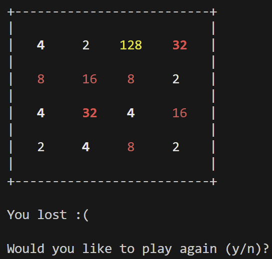

# QEMU-LC3

Implementation of Little Computer 3 on QEMU and Play 2048. 

## Build

```
mkdir build
cd build
../configure --target-list=lc3-softmmu
make -j16
```

For debugging: `../configure --target-list=lc3-softmmu --enable-debug`

## Run

```
./build/qemu-system-lc3 \
-bios ./bios/2048.obj \
-machine mylc3-v1 \
-nographic \
-monitor telnet::11236,server,nowait
```

## Display
