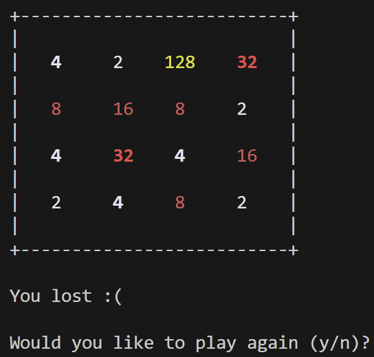

# QEMU-LC3

Implement Little Computer 3 on QEMU and play 2048. 

## Build

`mkdir build`

`cd build`

`../configure --target-list=lc3-softmmu`

`make`

## Run

```
QEMU-LC3/build/qemu-system-lc3 \
-bios QEMU-LC3/bios/2048.obj \
-machine mylc3-v1 \
-nographic \
-monitor telnet::11236,server,nowait
```

## Display
